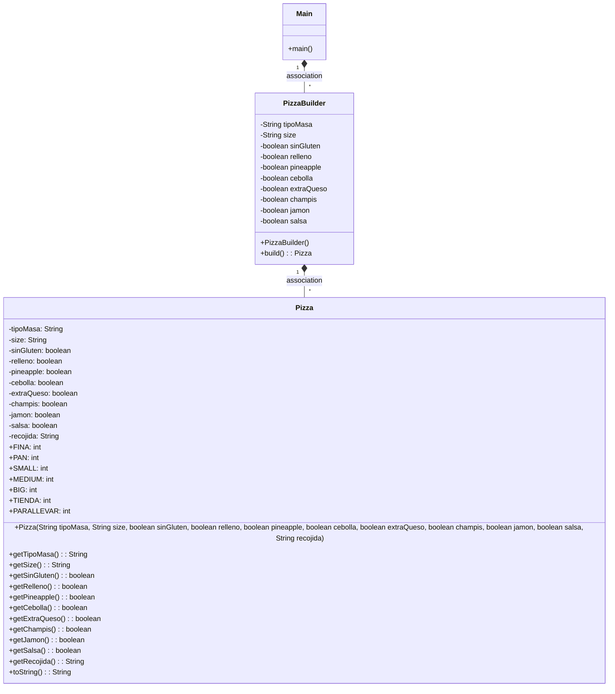

# Patrón builder
Crea una aplcación que crea objeto de una clase que tiene un constructor con muchisimos parametros.

Es decir, la clase tendrá muchos atributos que hay que inicializar al crear el objeto.

La clase que usará el main será: "Pizzas"

Esta clase tendrá muchos atributos, por ejemplo:

- masa (String) normal, integral, fina, masa pan, etc...
- relleno (boolean)
- tipo (int) familiar(1), mediana(2), pequeña(3)
- salsa (boolean)
- tipo salsa (String) barbacoa, solo tomate, salsa sin gluten
- cebolla (boolean)
- sinGluten (boolean)
- extraQueso (boolean)
- piña (boolean)
- champiñones (boolean)
- jamon (boolean)

Utilizar el toString para mostrar la pizza realizada.

Realizar varias pizzas en el programa principal.

Crea una rama nueva que se llame 'builder'

Luego con este repositorio como ejemplo, crear tu propio builder y cambia el main en esta nueva rama, para crear la pizza con el builder.

### Reflexiona:

- __¿Cual es la función de este patrón?__

Respuesta: La función de este patrón es separar la construcción de un objeto complejo de su representación, permitiendo dicha construcción de forma incremental y segmentada, hasta que se obtenga el resultado deseado pero partiendo de una misma base. Esto hace más sencilla la personalización y reduce la complejidad de la construcción al permitir que los detalles específicos de la construcción estén encapsulados en la clase Builder (PizzaBuilder en este caso).

- __¿Podríamos combinarlo con el patrón Factory?__

Respuesta: Sí, se podrían implementar ambos patrones. La clase Builder podría implementarse en la clase Factory, en lugar de en la clase Main directamente. De esta forma, Factory crearía los objetos por mediación de Builder.

- __¿Como es su Diagrama de clases? Realiza en el readme el diagrama__

