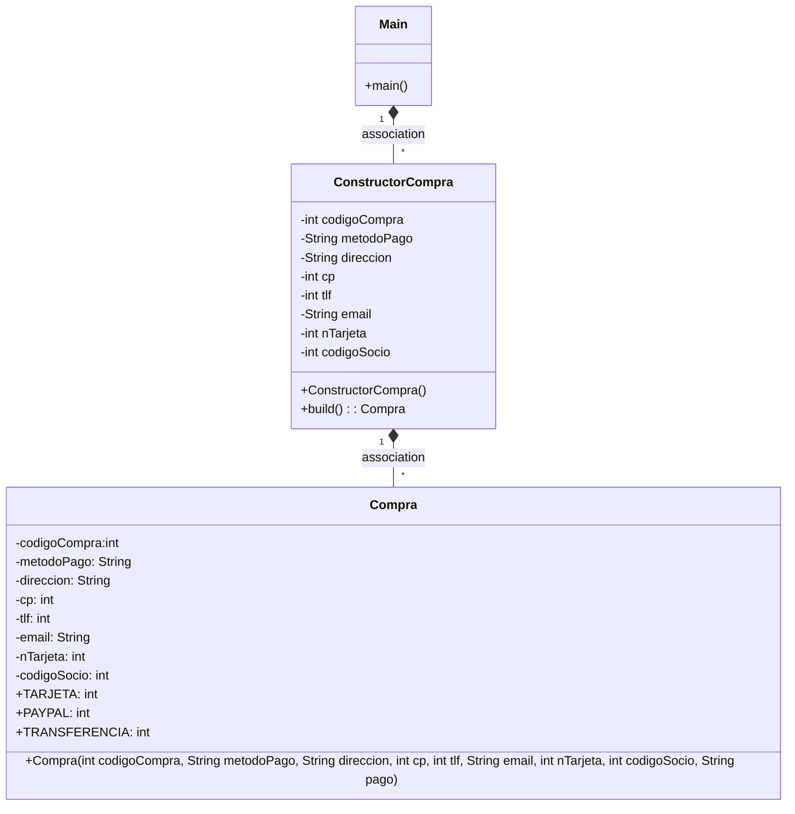

# Patrón builder
Crea una aplcación que crea objeto de una clase que tiene un constructor con muchisimos parametros.

Es decir, la clase tendrá muchos atributos que hay que inicializar al crear el objeto.

La clase que usará el main será: "Pizzas"

Esta clase tendrá muchos atributos, por ejemplo:

- masa (String) normal, integral, fina, masa pan, etc...
- relleno (boolean)
- tipo (int) familiar(1), mediana(2), pequeña(3)
- salsa (boolean)
- tipo salsa (String) barbacoa, solo tomate, salsa sin gluten
- cebolla (boolean)
- sinGluten (boolean)
- extraQueso (boolean)
- piña (boolean)
- champiñones (boolean)
- jamon (boolean)

Utilizar el toString para mostrar la pizza realizada.

Realizar varias pizzas en el programa principal.

Crea una rama nueva que se llame 'builder'

Luego con este repositorio como ejemplo, crear tu propio builder y cambia el main en esta nueva rama, para crear la pizza con el builder.

## Preguntas:

- __¿Cual es la función del patrón builder? Pon un ejemplo:__

El patrón Builder es un patrón de diseño que se utiliza para crear objetos complejos paso a paso, permitiendo la producción de diferentes representaciones del mismo objeto.

La idea principal detrás de este patrón es separar la construcción de un objeto complejo de su representación, de modo que el mismo proceso de construcción pueda crear diferentes representaciones del objeto. Esto significa que el código puede crear objetos complejos sin tener que conocer los detalles de su construcción.

Un ejemplo práctico del patrón Builder podría ser la construcción de un objeto de una clase "Compra" que contiene una lista de productos, un cliente y una dirección de envío. En lugar de crear un constructor con muchos parámetros, que puede ser difícil de usar y mantener, se puede utilizar el patrón Builder para crear objetos de "Compra" paso a paso.

Así, se podría crear una interfaz "ConstructorCompra" con métodos para agregar un producto, establecer el cliente y establecer la dirección de envío. Luego, se podrían implementar diferentes clases de constructores de Compra que sigan la misma interfaz, pero que construyan los objetos de diferentes maneras.


- __¿Podríamos combinarlo con el patrón Factory? Explícalo con algo de código como lo harías__

Sí, se podrían implementar ambos patrones. La clase Builder podría implementarse en la clase Factory, en lugar de en la clase Main directamente. De esta forma, Factory crearía los objetos por mediación de Builder.
En este ejemplo, en la clase Factory, concretamente en el método getProducto, podrían introducirse los métodos de los constructores para cada tipo de método de pago para instanciar distintas clases:
```
public static Compra getProducto(int metodoPago) {
switch (metodoPago) {
case TARJETA:
return new ConstructorTarjeta()
.build();
case PAYPAL:
return new ConstructorPaypal()
.build();
case TRANSFERENCIA:
return new ConstructorTransf()
.build();
default:
return null;
}
```
- __¿Cómo es el diagrama de clases de este ejemplo que has hecho?__

